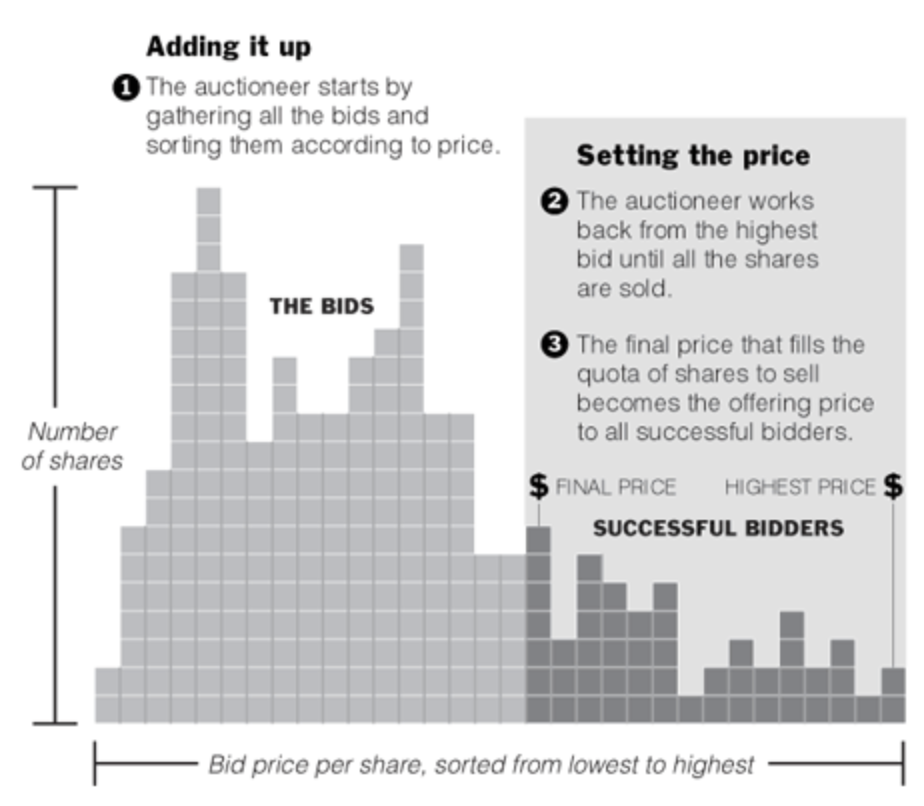

# EasyAuction

EasyAuction should become a platform to execute batch auctions for fair initial offerings and token buyback programs. Batch auctions are a market mechanism for matching limit orders of buyers and sellers of a particular good with one fair clearing price.
Already in traditional finance, batch auctions have established themselves as a tool for initial offerings, and in the blockchain ecosystem, they are expected to become a fundamental DeFi building lego brick for price-discovery as well.
The EasyAuction platform is inspired by the auction mechanism of the Gnosis Protocol v1, which has shown a significant product-market fit for initial dex offerings (IDOs) (cp. sales of DIA, mStable, etc…). EasyAuction improves significantly the user experience for IDOs, by settling up arbitrary many bids with a single clearing price instead of roughly 28 orders and thereby making the mechanism fairer, easier to use, and more predictable.
Given the emerging regulations for IDOs and utility sales - see MiCA -, EasyAuction is intending to comply with them and enabling new projects a safe start without legal risks.

## Use cases

### Initial token offering with a fair price-discovery

This batch auction mechanism allows communities, projects, and DAOs to offer their future stakeholders fair participation within their ecosystem by acquiring utility and governance tokens. One of the promises of DeFi is the democratization and communitization of big corporate infrastructures to build open platforms for the public good. By running a batch auction, these projects facilitate one of the fairest distribution of stakes. Projects should demonstrate their interest in fair participation by setting a precedence for future processes by choosing this fair auction principle over private multi-stage sales.
Auction based initial offerings are also picking up in the traditional finance world. Google was one of the first big tech companies using a similar auction mechanism with a unique clearing price to IPO. Nowadays, companies like Slack and Spotify are advocating similar approaches as well via Direct Listings: Selling their stocks in the pre-open auction on the first day of trading.
Overall this market for initial token offerings is expected to grow significantly over time together with the ecosystem. Even on gnosis protocol version 1, a platform not intended for this use case, was able to facilitate IDOs with a total of more than 20 million funding.

### Token buy back programs

Many decentralized projects have to buy back their tokens or auction off their tokens to clear deficits within their protocol. This EasyAuction platform allows them to schedule individual auctions to facilitate these kinds of operations.

### Initial credit offering

First implementations of [yTokens are live](https://defirate.com/uma-ycomp-shorts/) on the ethereum blockchain. The initial price finding and matching of creditor and debtor for such credit instruments can be done in a very fair manner for these kind of financial contracts.

## Protocol description

### The batch auction mechanism

In this auction type a pre-defined amount of tokens is auctioned off. Anyone can bid to buy these tokens by placing a buy-order with a specified limit price during the whole bidding time. At the end of the auction, the final price is calculated by the following method: The buy volumes from the highest bids are getting added up until this sum reaches the initial sell volume. The bid increasing the overall buy volume to is the bid defining the uniform clearing price. All bids with higher price will be settled and traded against the initial sell volume with the clearing price. All bids with a lower price will not be considered for the settlement. The principle is described best with the following diagram:


### Specific implementation batch auction

EasyAuction allows anyone to start a new auction of any ERC20 token (auctioningToken) against another ERC20 token (biddingToken). The entity initiating the auction, the auctioneer, has to define the amount of token to be sold, the minimal price for the auction, the end-time for the order cancellation period, the end-time of the auction, plus some additional parameters. The auctioneer initiates the auction with an ethereum transaction transferring the auctioningTokens and setting the parameters. From this moment on, anyone can participate as a buyer and submit bids. Each buyer places sell-orders with a specified limit price into the system. Until the "end-time of the order cancellation period", orders can still be canceled. Once this time has passed they can only be placed until the auction end-date.

There is only one exception: If the auction is configured to allow atomic-closures, then the next step - the price calculation - and placing one last order even after the auction end-date can be done within one ethereum transaction.
In all other cases, no further order placement is allowed once the auction end-date passed and the auction can be cleared by the on-chain price calculations.
The price calculation can happen over several ethereum transactions, in case the calculation is consuming more gas than available in one ethereum block. By setting a minium sell-amount per order, the
gas for a price calculation can be restricted, and even be forced to fit into one block. This can be useful, in case the auction should be atomically closable.

Once the price of an auction has been calculated, everyone can claim their part of the auction. The auctioneer can withdraw the bought funds, the buyers being matched in the auction can withdraw their bought tokens. The buyers bidding with a too low price which were not matched in the auction can withdraw their bidding funds back.

## Comparison to Dutch auctions

The proposed batch auction system has a number of advantages over dutch auction.

- The biggest advantage is certainly that buyers don't have to wait for a certain time to submit orders, but that they can submit orders at any time. This makes the system much more convenient for users.
- Dutch auctions have a very high activity right before the auction is closing. If pieces of the infrastructure are not working reliable during this time period, then prices can fall further than expected, causing a loss for the auctioneer. Also, high gas prices during this short time period can be a hindering factor for buyers to quickly join the auction.
- Dutch auctions calculate their price based the blocktime. This pricing is hard to predict for all participants, as the mining is a stochastical process Additionally, the unpredictability for the mining time of the next block
- Dutch auctions are causing a gas price bidding war to close the auction. In contrast in batch auction, different buyers will bid against other bidder in the mem-pool. Especially, once [EIP-1559](https://eips.ethereum.org/EIPS/eip-1559) is implemented and the mining of a transaction is guaranteed for the next block, then bidders have to compete on bidding limit-prices instead of the gas-prices to get included into the auction.

## Warnings

In case the auction is expected to raise more than 2^96 units of the biddingToken, don't start the auction,as it will not be settlable. This corresponds to about 79 billion DAI.

Prices between biddingToken and auctioningToken are expressed by a fraction whose components are stored as uint96. Make sure your expected prices are representable as such fractions.

## Instructions

### Backend

Install dependencies

```
git clone https://github.com/Gnosis-Auction/auction-contracts.git
cd auction-contracts
yarn
yarn build
```

Running tests:

```
yarn test
```

Run migration:

```
yarn deploy --network $NETWORK
```

Verify on etherscan:

```
npx hardhat etherscan-verify --license None --network rinkeby
```

## Running scripts

### Create auctions

New auctions can be started with a hardhat script or via a safe app. The safe-app can be found here: [Auction-Starter](https://github.com/gnosis/ido-starter)
A new auction selling the token `0xc778417e063141139fce010982780140aa0cd5ab` for `0x5592EC0cfb4dbc12D3aB100b257153436a1f0FEa` can be started using the hardhat script like that:

```
export NETWORK=<Your Network>
export GAS_PRICE_GWEI=<Your gas price>
export INFURA_KEY=<Your infura key>
export PK=<Your private key>
yarn hardhat initiateAuction --auctioning-token "0xc778417e063141139fce010982780140aa0cd5ab" --bidding-token "0x5592EC0cfb4dbc12D3aB100b257153436a1f0FEa" --sell-amount 0.1 --min-buy-amount 50 --network $NETWORK
```

Please look in the hardhat script `/src/tasks/initiate_new_auction` to better understand all parameters.

A more complex example for starting an auction would look like this:

```
yarn hardhat initiateAuction --auctioning-token "0xc778417e063141139fce010982780140aa0cd5ab" --bidding-token "0x5592ec0cfb4dbc12d3ab100b257153436a1f0fea" --sell-amount 0.5 --min-buy-amount 800 --auction-end-date 1619195139 --order-cancellation-end-date 1619195139 --allow-list-manager "0x80b8AcA4689EC911F048c4E0976892cCDE14031E" --allow-list-data "0x000000000000000000000000740a98f8f4fae0986fb3264fe4aacf94ac1ee96f"  --network $NETWORK
```

### Settle auctions

Auctions can be settled with the clearAuction script permissionlessly by any account:

```
export NETWORK=<Your Network>
export GAS_PRICE_GWEI=<Your gas price>
export INFURA_KEY=<Your infura key>
export PK=<Your private key>
yarn hardhat clearAuction --auction-id <Your auction ID> --network $NETWORK
```

### Allow-Listing: Generating signatures

Signatures for an auction with participation restriction can be created like that:

1. Create a file: `addresses.txt` with comma separated addresses that should be allow-listed for the auction at the root of the folder
2. Initiate the auction and remember your auctionId
3. Run the following script:

```
export NETWORK=<Your Network>
export INFURA_KEY=<Your infura key>
export PK=<Your private key _for the signing address_. The address for this key should not hold any ETH>
export PINATA_JWT=<Your Pinata Key for saving the signatures>
yarn hardhat generateSignatures --auction-id "Your auctionId" --file-with-address "./your_address_inputs.txt" --network $NETWORK
```

The generated signatures will be uploaded to your pinata account. Currently in order to access these signatures, a Front End instance needs to be hosted with the same pinata key in order to access them on the auction site. We are currently looking for other decentralised storage options to avoid this step.

## Contract Addresses
* Mainnet:
  * EasyAuction: 0x0b7fFc1f4AD541A4Ed16b40D8c37f0929158D101
  * DepositAndPlaceOrder: 0x10D15DEA67f7C95e2F9Fe4eCC245a8862b9B5B96
  * AllowListOffChainManaged: 0x0F4648d997e486cE06577d6Ee2FecBcA84b834F4

* Gnosis:
  * EasyAuction: 0x0b7fFc1f4AD541A4Ed16b40D8c37f0929158D101
  * DepositAndPlaceOrder: 0x845AbED0734e39614FEC4245F3F3C88E2da98157
  * AllowListOffChainManaged: 0x0F4648d997e486cE06577d6Ee2FecBcA84b834F4

* Polygon:
  * EasyAuction: 0x0b7fFc1f4AD541A4Ed16b40D8c37f0929158D101
  * DepositAndPlaceOrder: 0x93D2BbA07b44e8F2b02F7DA164eE4f7442a3B618
  * AllowListOffChainManaged: 0x0480A370279B2e70378188E1bd4f1cD7D76D8aD2

* Mumbai:
  * EasyAuction: 0x4100aF1E6e8bBc174fc5da4D409e1e3C03F1f85E
  * DepositAndPlaceOrder: 0x7f49Ee20f2E83Ca53B08944938E9B6Fad8e3E3B6
  * AllowListOffChainManaged: 0xE0AD16EB7Ea467C694E6cFdd5E7D61FE850e8B53

* Goerli:
  * EasyAuction: 0x1fbab40c338e2e7243da945820ba680c92ef8281
  * DepositAndPlaceOrder: 0xc6e51F2cb369F03672197D0C31Dd5F0d9566217B
  * AllowListOffChainManaged: 0xE0AD16EB7Ea467C694E6cFdd5E7D61FE850e8B53

* Avalanche:
  * EasyAuction: 0xb5D00F83680ea5E078e911995c64b43Fbfd1eE61
  * DepositAndPlaceOrder: 0x193c8993480DF4c1dBBdB39dB07511f7D789cedb
  * AllowListOffChainManaged: 0x5ae9b340A98085D0fc25Ae98A5eB704bA08E0dF8

* Binance Smart Chain:
  * EasyAuction: 0x231F3Fd7c3E3C9a2c8A03B72132c31241DF0a26C
  * DepositAndPlaceOrder: 0x4bAbb4b89ed7180aeF95F872f621afEE724F0344
  * AllowListOffChainManaged: 0xE0AD16EB7Ea467C694E6cFdd5E7D61FE850e8B53

* Binance Smart Chain Testnet:
  * EasyAuction: 0x231F3Fd7c3E3C9a2c8A03B72132c31241DF0a26C
  * DepositAndPlaceOrder: 0x14082EDeFCa073578d2C16E8fB42967bEc188E59
  * AllowListOffChainManaged: 0xE0AD16EB7Ea467C694E6cFdd5E7D61FE850e8B53

* Fuji:
  * EasyAuction: 0xa5cd8D8effACB7Ad861e3797404924199D1463a5
  * DepositAndPlaceOrder: 0x39cbA0cC28EE67EAa8134C0e80a061c13EBC3603
  * AllowListOffChainManaged: 0x2f0045AA41879184a283A644F25Ec4FA31C8767E

* Rinkeby:
  * EasyAuction: 0xC5992c0e0A3267C7F75493D0F717201E26BE35f7
  * DepositAndPlaceOrder: 0x8624fbDf455D51B967ff40aaB4019281A855f008
  * AllowListOffChainManaged: 0x7C882F296335734B958b35DA6b2595FA00043AE9

* Sepolia:
  * EasyAuction: 0x231F3Fd7c3E3C9a2c8A03B72132c31241DF0a26C
  * DepositAndPlaceOrder: 0xDDeFBcF94d46E771dad74882012704f51CA15ed8
  * AllowListOffChainManaged: 0xE0AD16EB7Ea467C694E6cFdd5E7D61FE850e8B53

* Base Mainnet:
  * EasyAuction: 0xcAe780DdD607C2081fbB4654E719f77F5e8907BF
  * DepositAndPlaceOrder: 0x7bd070D175988C9FF97AcCD61170b65a52e2263D
  * AllowListOffChainManaged: 0xE0AD16EB7Ea467C694E6cFdd5E7D61FE850e8B53

* Base Goerli:
  * EasyAuction: 0x231F3Fd7c3E3C9a2c8A03B72132c31241DF0a26C
  * DepositAndPlaceOrder: 0xBDf182cB6a78E43c95F0F3cC11201cf561830368
  * AllowListOffChainManaged: 0xE0AD16EB7Ea467C694E6cFdd5E7D61FE850e8B53

## Audit

The solidity code was audited by Adam Kolar, from the G0 Group. The report can be found [here](https://github.com/g0-group/Audits/blob/master/GnosisAuctionFeb2021.pdf) and [here](https://github.com/g0-group/Audits/blob/master/GnosisAuctionMar2021.pdf).
